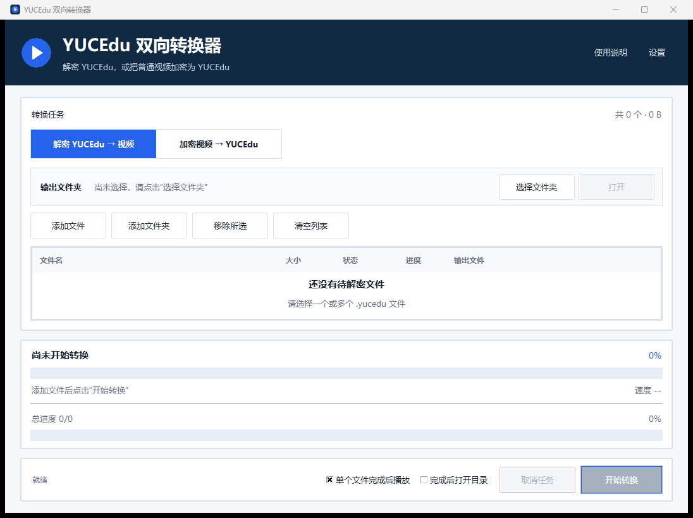

<div align="center">

# 🎬 YUCEdu Converter

**简单、离线、跨平台的 YUCEdu 双向转换小工具**

<p>
  <a href="https://github.com/Chengxiaoyu1119/yucedu-converter/actions/workflows/ci.yml"></a>
  <a href="https://github.com/Chengxiaoyu1119/yucedu-converter/releases/latest"></a>
  <a href="LICENSE"></a>
  
  
</p>

[下载正式版](https://github.com/Chengxiaoyu1119/yucedu-converter/releases/latest) · [使用说明](docs/使用说明.md) · [macOS 说明](docs/macOS说明.md) · [更新日志](docs/更新日志.md)

</div>



## ✨ 这是做什么的

`yucedu-converter` 是一个本地桌面小工具，用于在当前已验证配置下完成 `.yucedu` 与普通视频之间的双向转换。

| 功能 | 说明 |
|---|---|
| 🔓 解密 | 将 `.yucedu` 转换为可由普通播放器打开的视频 |
| 🔒 加密 | 将 MP4、MKV、AVI、MOV 等常见视频转换为 `.yucedu` |
| 📦 批量处理 | 支持多文件、文件夹、任务进度、取消和自动改名 |
| ▶️ 播放联动 | 支持 PotPlayer、IINA、VLC、系统播放器及原播放器 |
| 🧩 双平台 | 提供 Windows x64、macOS Apple Silicon 和 Intel 版本 |
| ✅ 完整校验 | 检查转换资源、输出文件和发布包 SHA256 |

> [!IMPORTANT]
> 不同来源的 `.yucedu` 可能使用不同配置。当前版本只维护已经验证的配置档案与兼容资源。

## ⬇️ 下载

当前稳定版本：**v2.1.0**

| 设备 | 下载 | 安装方式 |
|---|---|---|
| Windows 10/11 x64 | [下载 ZIP](https://github.com/Chengxiaoyu1119/yucedu-converter/releases/download/v2.1.0/yucedu-converter-v2.1.0-windows-x64.zip) | 完整解压后运行 `YUCEdu双向转换器.exe` |
| Apple Silicon Mac | [下载 arm64 DMG](https://github.com/Chengxiaoyu1119/yucedu-converter/releases/download/v2.1.0/yucedu-converter-v2.1.0-macos-arm64.dmg) | 打开 DMG，将 App 拖入 Applications |
| Intel Mac | [下载 x64 DMG](https://github.com/Chengxiaoyu1119/yucedu-converter/releases/download/v2.1.0/yucedu-converter-v2.1.0-macos-x64.dmg) | 打开 DMG，将 App 拖入 Applications |

每个安装包旁边都提供同名 `.sha256.txt` 校验文件。全部资产见 [Releases](https://github.com/Chengxiaoyu1119/yucedu-converter/releases)。

> [!NOTE]
> macOS 公开包采用 ad-hoc 完整性签名。首次启动时按住 Control 点击应用，再选择“打开”。

## 🚀 三步使用

```text
① 选择解密或加密  →  ② 选择输出文件夹  →  ③ 添加文件并开始处理
```

1. 选择“解密 YUCEdu”或“加密视频”。
2. 点击“选择文件夹”，决定本次输出位置。
3. 添加文件或文件夹，点击“开始转换”。

输出位置每次启动后都由用户主动选择。详细操作见 [使用说明](docs/使用说明.md)。

## 🖥️ 平台支持

| 项目 | Windows | macOS |
|---|:---:|:---:|
| 图形界面 | ✅ | ✅ |
| 解密与反向加密 | ✅ | ✅ |
| 批量任务与取消 | ✅ | ✅ |
| 系统默认播放器 | ✅ | ✅ |
| PotPlayer | ✅ | — |
| IINA | — | ✅ |
| VLC | ✅ | ✅ |
| 原播放器联动 | WinNetPlayer1018 | MacNetPlayer |
| 发布格式 | ZIP | DMG |

## 📚 文档

<details>
<summary><strong>用户文档</strong></summary>

- [使用说明](docs/使用说明.md)
- [macOS 使用说明](docs/macOS说明.md)
- [转换格式说明](docs/格式说明.md)
- [兼容报告](docs/兼容报告.md)
- [发布包说明](docs/发布说明.md)

</details>

<details>
<summary><strong>开发与维护</strong></summary>

- [项目结构、技术栈与路径规范](docs/项目结构.md)
- [Windows 与 macOS 构建说明](docs/构建说明.md)
- [多平台路线图](docs/路线图.md)
- [更新日志](docs/更新日志.md)
- [第三方组件](docs/第三方组件.md)
- [参与贡献](.github/CONTRIBUTING.md)
- [安全说明](.github/SECURITY.md)

</details>

<details>
<summary><strong>上游与研究资料</strong></summary>

- [上游播放器来源](docs/研究/上游来源.md)
- [MacNetPlayer 本地分析](docs/研究/Mac播放器.md)
- [网络播放器下载中心](https://www.drmsoft.cn/playernetN7.2/down.asp)

原播放器、真实媒体和本地回归样本保存在仓库外。

</details>

## 🛠️ 从源码运行

要求 Python 3.11 或更高版本。

<details>
<summary><strong>Windows</strong></summary>

```powershell
python -m venv .venv
.\.venv\Scripts\Activate.ps1
python -m pip install -e .
python -m yucedu_converter
```

构建正式包：

```powershell
python -m pip install -e ".[build]"
.\scripts\build_windows.ps1
.\scripts\package_release.ps1
```

</details>

<details>
<summary><strong>macOS</strong></summary>

```bash
python3 -m venv .venv
source .venv/bin/activate
python -m pip install -e .
python -m yucedu_converter
```

构建正式包：

```bash
python -m pip install -e ".[macos]"
bash scripts/build_macos.sh
bash scripts/package_macos.sh
```

</details>

## 🧱 项目定位

这是一个保持简单的小工具项目：

- 使用 Python、Tkinter 和 `cryptography`。
- 没有服务器、数据库、账号系统或网页前端。
- 生成目录、本地播放器、真实视频和回归样本均由 Git 排除。
- Windows 与 macOS 使用同一套转换核心，平台差异集中在播放器、路径和打包层。

## 📄 许可证

项目源码使用 [MIT License](LICENSE)。第三方组件与许可证见 [第三方组件说明](docs/第三方组件.md)。
